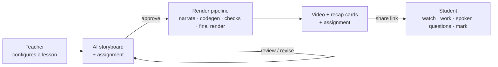

# Klarblick

AI micro-lesson studio for teachers. A teacher picks a grade, topic, and subtopic; an AI plans a
storyboard the teacher can review and revise scene by scene; on approval the app generates a
narrated Manim video (720p, burned-in captions), three recap cards, and an assignment. The finished
lesson is published as a student package under a shareable link, where the student watches the
video, submits written work, answers spoken follow-up questions grounded in their own writing, and
receives a mark.

Subjects are data packs (`content/math`, `content/physics`) — catalogue plus prompt prose — so a new
subject needs no pipeline changes.

## Architecture

Two local processes, no database — job state is JSON files under `jobs/`:

| Process | Location | Port |
| --- | --- | --- |
| Web UI (Next.js) | `apps/web` | 3000 |
| API (FastAPI) | `services/api` | 8000 |

High-level flow — the render pipeline (`services/api/app/pipeline.py`) runs in the background
after the teacher approves:



Manim runs as a local subprocess after AST validation, with a sanitized environment that carries no
model or ElevenLabs credentials. Two deterministic gates run before the paid visual review: one
compares animation length against narration length, the other rejects frames whose outer edge
contains lesson content. The lower caption band (`y = -4.0` to `-3.0`) is kept clear for FFmpeg.

Key modules:

| Concern | File |
| --- | --- |
| Routes and job endpoints | `services/api/app/main.py` |
| Pipeline orchestration and repair loop | `services/api/app/pipeline.py` |
| Manim subprocess, gates, frame sampling | `services/api/app/rendering.py` |
| AST and API safety rules | `services/api/app/validation.py` |
| Model calls (storyboard, code, review, probing, marking) | `services/api/app/ai.py` |
| Subject packs | `services/api/app/subjects.py`, `content/<subject>/` |
| Prompts, one per task | `prompts/*.md` |

## Setup

Requirements: [uv](https://docs.astral.sh/uv/), Node.js 22+, and MiKTeX (LaTeX).

```powershell
# 1. Configuration
Copy-Item .env.example .env
# then set MODEL_NAME, the matching provider API key, ELEVENLABS_API_KEY, ELEVENLABS_VOICE_ID

# 2. Dependencies
uv python install 3.12
uv venv --python 3.12 .venv
uv pip install --python .venv\Scripts\python.exe -r services\api\requirements.txt
npm install --prefix apps\web

# 3. Verify the toolchain (Node, Manim, LaTeX)
./scripts/check-prereqs.ps1
```

## Run

```powershell
./scripts/start-api.ps1   # terminal 1 — FastAPI on :8000
./scripts/start-web.ps1   # terminal 2 — Next.js on :3000
```

Open `http://localhost:3000`.

## Checks

```powershell
.\.venv\Scripts\python.exe -m unittest tests.test_minimal_checks tests.test_assignment_flow -v  # free, seconds
npm run typecheck --prefix apps\web                                                             # free
.\.venv\Scripts\python.exe scripts\run_live_smoke.py   # paid end-to-end render, needs both providers configured
```

When a live run fails, `jobs/jobs/<job-id>/attempts.log` records what each attempt was rejected for.
